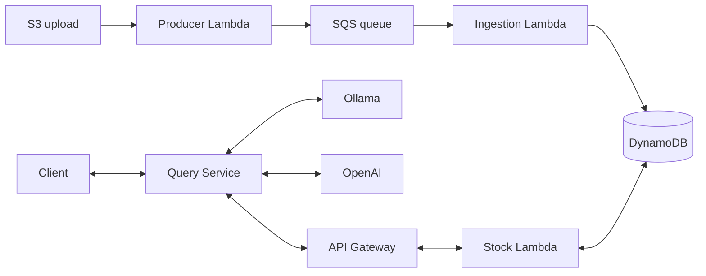

```mermaid
flowchart LR
    S3[S3 upload] --> Producer[Producer Lambda]
    Producer --> Queue[SQS queue]
    Queue --> Ingestion[Ingestion Lambda]
    Ingestion --> DynamoDB[(DynamoDB)]

    Client[Client] <--> Query[Query Service]
    Query <--> Ollama[Ollama]
    Query <--> OpenAI[OpenAI]
    Query <--> API[API Gateway]
    API <--> Stock[Stock Lambda]
    Stock <--> DynamoDB
```